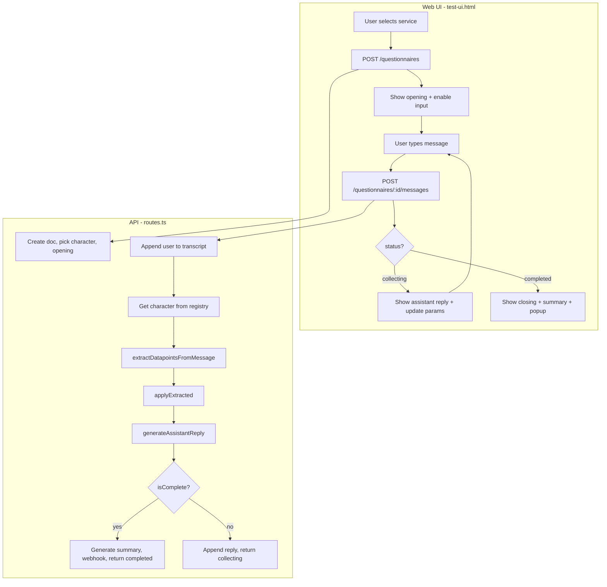

# Web Chat Questionnaire Logic (Detailed)

This document describes how the questionnaire works in the web chat from start to finish: session creation, message handling, extraction, reply generation, and completion.

---

## 1. High-Level Flow

- **Web UI**: User picks a service → session is created → user sends messages → each message is sent to the API; the UI shows the assistant reply and (when provided) optional quick-reply chips and collected parameters.
- **API**: For each message it appends the user turn, runs **extraction** (LLM + fallback regex), **apply** (save high-confidence slots), then **generateAssistantReply** (LLM). Completion is decided by a per-service **coverage policy**; when complete it generates summary and optionally calls the webhook.

---

## 2. Session Start (POST /questionnaires)

**File:** `src/routes.ts`

1. **Input:** `{ service, channel?, userRef? }`. `service` is required (e.g. `residential_interiors`).

2. **Character resolution:**
   - `pickCharacter(service)` from `@tatvaops/core` returns the core character for that service (name, persona, etc.).
   - The app’s **character registry** (`engine/characterRegistry.ts`) is used for the **dynamic flow**: it holds characters that have a `datapoints` list (what to collect).
   - If `getCharacter(coreCharacter.id)` exists in the app registry, that ID is used; otherwise `characterId` is set to `config.WHATSAPP_CHARACTER_DEFAULT` (default `'aadhya'`).
   - So for the dynamic engine we always end up with a character that has `datapoints` (usually Aadhya).

3. **Document creation:**
   - `QuestionnaireStore.create()` creates an in-memory doc with: `id`, `service`, `characterId`, `channel`, `userRef`, `status: 'collecting'`, `parameters: {}`, `transcript: []`, timestamps.

4. **Opening message:**
   - Opening text comes from `displayCharacter.language?.openingPhrases?.[0]` or `coreCharacter.language?.openingPhrases?.[0]` or `'Hello!'`.
   - That message is pushed to `transcript` as one `assistant` turn.

5. **Response:** `201` with `{ id, service, character (name), nextQuestion (opening) }`.

So: one session = one questionnaire “conversation” for one service, tied to one character that has a fixed list of datapoints (e.g. Aadhya’s list).

---

## 3. Sending a Message (POST /questionnaires/:id/messages)

**File:** `src/routes.ts`

**Input:** `{ text }` (required).

### Step 1: Load doc and append user

- Load `doc` by `id`. Append `{ role: 'user', text, ts }` to `doc.transcript` and update `doc.updatedAt`.

### Step 2: Resolve character

- `character = getCharacter(doc.characterId) || getCharacter(config.WHATSAPP_CHARACTER_DEFAULT || 'aadhya')`.
- If no character, respond with `500`. The character’s `datapoints` define which fields can be extracted and asked for.

### Step 3: Extract datapoints (multi-slot from one message)

- **Function:** `extractDatapointsFromMessage(text, doc, character)` in `engine/conversation.ts`.
- **Purpose:** Turn the user’s free-text message into structured key–value pairs (with confidence) for the **pending** datapoints only (i.e. fields the character has that are not yet in `doc.parameters`).
- **How:**
  - Builds a list of pending datapoints from `character.datapoints` that are not yet in `session.parameters`.
  - Sends an **extraction prompt** to Gemini with:
    - Last assistant message (context: “what the bot just asked”),
    - User message,
    - List of field ids + hints for those pending datapoints.
  - Asks for **strict JSON** like `{"field_id": {"value": ..., "confidence": 0.0–1.0}, ...}`.
  - If the LLM response is not valid JSON, falls back to **regex-based extraction** (budget, timeline, BHK, sqft, project_type, style, contact_pref, callback_time, etc.).
  - **Context validation** (`validateExtractionContext`) fixes common confusions, e.g.:
    - If the bot asked about “when to call”, time-like answers are treated as `callback_time` (not `preferred_start`).
    - If the bot asked about project duration, “X days/weeks/months” is treated as `timeline`.
  - If the user message is detected as **ambiguous** (e.g. “maybe”, “not sure”), confidence for extracted slots is capped (e.g. 0.6) and they can be marked `isAmbiguous`.
- **Output:** `Record<datapointId, { value, confidence, isAmbiguous? }>`.

So: **one user message can fill multiple datapoints at once** (e.g. “2BHK apartment, 1200 sqft, modern” → project_type, rooms, size_sqft, style).

### Step 4: Apply extracted to session

- **Function:** `applyExtracted(doc, extracted)` in `engine/conversation.ts`.
- For each extracted entry, if `confidence >= EXTRACTION_CONFIDENCE_THRESHOLD_AUTO` (default **0.65** from `config`), write to `doc.parameters[key]` as `{ value, confidence, ts }`.
- Lower-confidence or missing keys are not written, so the bot can ask again later.

### Step 5: Generate assistant reply

- **Function:** `generateAssistantReply(doc, character, { lastUserMessage: text })` in `engine/conversation.ts`.

**5a) Completion check**

- **Function:** `isConversationComplete(session)` → implemented as `isCoverageSatisfied(session.parameters, session.service)` in `engine/coverage-policy.ts`.
- Each service has a **coverage policy**: a list of **required** (and optionally optional) datapoint ids. For example, `residential_interiors` requires: `project_type`, `rooms`, `size_sqft`, `style`, `budget`, `timeline`, `contact_pref`.
- If for every required id the session has a value (including when the stored value is `{ value, ... }`), the conversation is considered complete.
- If complete:
  - A **closing message** is generated via Gemini (CLOSING_PROMPT_TEMPLATE) using project type, style, contact pref, callback time, user ref.
  - That reply is returned with `isComplete: true`. The route then sets `doc.status = 'completed'`, appends the closing to transcript, generates project summary, optionally calls webhook, and returns `status: 'completed'` with summary and parameters.

**5b) If not complete: next natural question**

- **Conversation state:** Stored in `doc.conversationMeta` (mood, moodHistory, ambiguousFields, clarificationCount, turnCount). Read/updated by `getConversationState` / `updateConversationState`.
- **Mood detection:** From the last user message, `detectMood()` classifies: `positive` | `neutral` | `confused` | `frustrated` | `rushed` | `uncertain` using keyword lists (e.g. “great”, “not sure”, “asap”).
- **Pending datapoints:** `collectPendingDatapoints(session, character)` returns character datapoints that are not yet in `session.parameters`, sorted by `PREFERRED_ORDER` and priority (e.g. project_type, rooms, size_sqft, style before budget/timeline).
- **Mood-based filtering:** If mood is `frustrated` or `rushed`, only **required** datapoints (from coverage policy) are kept in `effectivePending`; optional ones are skipped so the bot doesn’t ask extra questions.
- **Clarification handling:** If the user message is detected as “asking for examples” (e.g. “like?”, “suggest”, “options?”), an **ambiguity section** is added to the prompt telling the model to **only** give 2–3 examples for the **same** topic and not move to the next datapoint.
- **Prompt:** ASSISTANT_PROMPT_TEMPLATE is filled with:
  - Character name, persona summary, tone,
  - Current mood and mood guidance,
  - “What we already know” (formatted from `doc.parameters`),
  - “What’s still missing” (formatted from `effectivePending`),
  - Last N turns of transcript (`MAX_CONTEXT_TURNS`, default 6),
  - Optional ambiguity/clarification section.
- **Rules in prompt:** One short question per message, no repeated questions for already-collected data, no banned phrases, callback_time vs preferred_start awareness, variety in openings.
- **LLM call:** Gemini returns one natural-language reply. `humanizeResponse()` post-processes (e.g. strip robotic phrases, vary starters by mood, trim length).
- **Return:** `{ reply, isComplete: false, mood }`. The route appends this reply to `doc.transcript`, saves the doc, and returns it to the client as `nextQuestion` / `nextMessage`.

So: the **same** character and **same** datapoint list drive both extraction and reply generation; **completion** is decided only by the **per-service coverage policy** (required fields).

### Step 6: Response to client

- **If completed:**  
  `{ id, status: 'completed', parameters, summary, nextQuestion (closing) }`.
- **If still collecting:**  
  `{ id, status: 'collecting', nextQuestion, nextMessage, collected, parameters, missingCritical, options: [], ... }`.  
  `missingCritical` is the list of required field ids that still have no value (from `getRequiredFieldsForService(doc.service)`). The UI can use this to show progress; option chips are currently not populated by the dynamic flow (empty array).

---

## 4. Coverage Policy (When Is the Conversation Complete?)

**File:** `src/engine/coverage-policy.ts`

- **Purpose:** Define per service which datapoint ids are **required** (and optionally which are optional).
- **Functions:**
  - `getRequiredFieldsForService(service)` → list of required ids.
  - `getOptionalFieldsForService(service)` → list of optional ids.
  - `isCoverageSatisfied(parameters, service)` → true iff every required id has a value in `parameters` (handles both plain values and `{ value }` objects).
- **Examples:**
  - `residential_interiors`: required = project_type, rooms, size_sqft, style, budget, timeline, contact_pref; optional = must_haves, avoid, site_ready, etc.
  - Other services (commercial_interiors, painting, etc.) may have a smaller required set (e.g. no `rooms`) but still project_type, size_sqft, budget, timeline, contact_pref.

So: **completion is adaptive per service**; the character’s datapoints define what *can* be collected, and the coverage policy defines what *must* be collected to consider the questionnaire done.

---

## 5. Character and Datapoints

**File:** `src/engine/characterRegistry.ts`

- Characters are loaded from XML under `config/characters/` or from the in-memory **FALLBACK_AADHYA** if no XML is found.
- The dynamic flow needs a character with **datapoints**: each entry has `id`, `label`, `priority`, `hint`, and optionally `allowMultiple`.
- **Aadhya’s datapoints** (used for most services when the core character is not in the app registry) include: project_type, rooms, size_sqft, style, notes, must_haves, avoid, site_ready, storage_needs, lighting_pref, budget, timeline, contact_pref, callback_time, preferred_start, moodboard_refs.
- **Order of asking** is influenced by `PREFERRED_ORDER` and `priority` in `conversation.ts` (e.g. project_type, rooms, size_sqft, style before budget/timeline; contact/callback last).

So: the **same** character (and thus same datapoint ids) is used for both **extraction** (which fields to try to fill from the user message) and **reply** (which fields are still “pending” and what to ask next).

---

## 6. Web UI Behavior (test-ui.html)

- **Start:** User clicks a service → `POST /questionnaires` with `{ service }` → UI stores `currentQuestionnaireId`, `currentService`, character name, shows opening. For most services a **trigger message** (e.g. “Hello! I am exploring residential interior support for my home.”) is auto-sent after 450 ms to start the conversation.
- **Send:** On submit (or Enter), the UI appends the user message to the chat, shows a typing indicator, and calls `POST /questionnaires/:id/messages` with `{ text }`.
- **Response handling:**
  - **status === 'completed':** Show closing text (`data.nextMessage || data.nextQuestion`), disable input, show popup, update “Collected Parameters” from `data.parameters`, and show project summary if `data.summary` exists.
  - **status === 'collecting':** Show assistant message from `data.nextMessage || data.nextQuestion`. If `data.options` has items, show optional quick-reply chips and set placeholder to “Type your message or tap a quick reply…” otherwise use “Message [character]…”. Update `collectedParameters` from `data.collected || data.parameters` and refresh the parameters list (with support for `{ value }` shape).
- **Parameters display:** Each key is shown with its value; if the value is an object with `value`, that inner value is displayed (so both old plain values and new `{ value, confidence }` shape work).

So: the UI is **natural-input first**; chips are optional and only shown when the API returns options (dynamic flow currently returns no options). Completion and summary are driven entirely by the API.

---

## 7. Config and Thresholds

**File:** `src/config.ts`

- **EXTRACTION_CONFIDENCE_THRESHOLD_AUTO** (default 0.65): Only extracted slots with confidence ≥ this are written to `doc.parameters`.
- **MAX_CONTEXT_TURNS** (default 6): Number of recent transcript turns included in the assistant prompt.
- **MAX_TURNS_BEFORE_DIRECT_ASK**: Used in the prompt for the model; can nudge toward more direct questions after many turns.
- **WHATSAPP_CHARACTER_DEFAULT** (default `'aadhya'`): Fallback character id when the core character is not in the app registry.

---

## 8. End-to-End Summary

| Stage | What happens |
|-------|----------------|
| **Start** | User picks service → API creates session with a character that has `datapoints` (usually Aadhya), returns opening. UI may auto-send a trigger message. |
| **Each message** | User text is appended to transcript. Character is resolved from registry. **Extraction** (LLM + regex fallback) fills pending datapoints with confidence; only slots above threshold are **applied** to `doc.parameters`. **Reply** is generated: if **coverage** (per-service required fields) is satisfied → closing + summary + webhook + `status: 'completed'`; else one natural follow-up question from ASSISTANT_PROMPT (mood, pending list, transcript). Reply is appended to transcript and returned. |
| **Completion** | Decided by `isCoverageSatisfied(parameters, service)` using the coverage policy. Summary is generated from flattened parameters; webhook is called if configured. |
| **Web UI** | Shows messages, optional chips, and “Collected Parameters” from API; on completed status shows closing, summary, and disables input. |

So: the web chat questionnaire is **dynamic** (one message can fill many slots), **adaptive** (completion and required fields are per service), and **conversational** (one natural question per turn, mood and clarification handled, no fixed question order beyond preferred order and priority).
